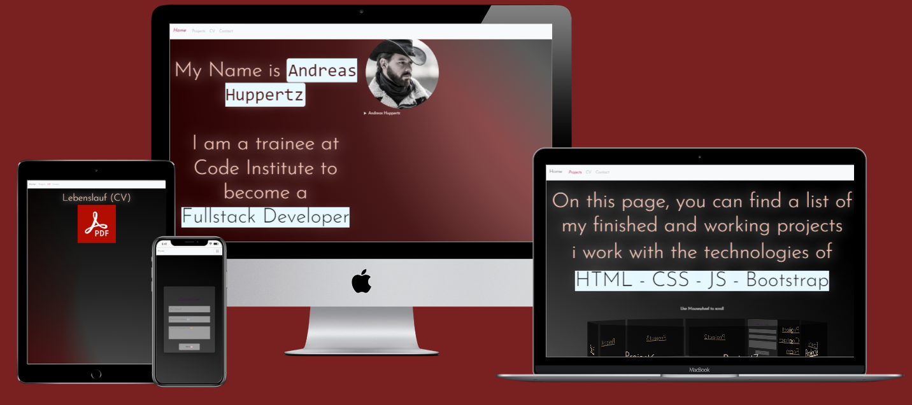
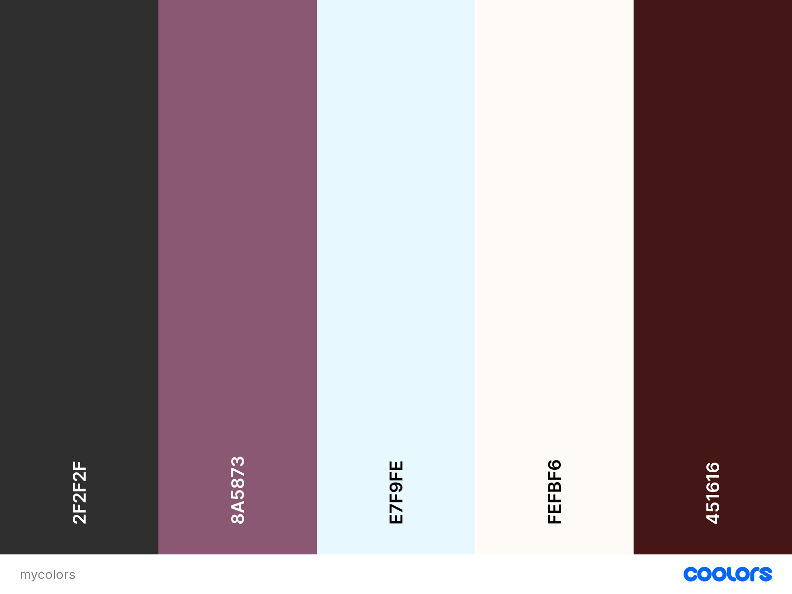

# Code Institute Projekt 1 HTML and CSS

 # My Portfolio Website

 
 
 [View MrhaJu on Github Pages](https://mrhaju.github.io/Code-Institute-Projekt-1-CSS-HTML/)

This website was created to showcase my skills as an programmer

## Contents

* [User Experience (UX)](#User-Experience-(UX))
    * [Initial Discussion](#Initial-Discussion)
    * [User Stories](#User-Stories)

* [Design](#Design)
  * [Colour Scheme](#Colour-Scheme)
  * [Typography](#Typography)
  * [Imagery](#Imagery)
  * [Wireframes](#Wireframes)
  * [Features](#Features)
  * [Accessibility](#Accessibility)
  * [Technologies Used](#Technologies-Used)
  * [Languages Used](#Languages-Used)
  * [Frameworks, Libraries & Programs Used](#Frameworks,-Libraries-&-Programs-Used)

* [Deployment & Local Development](#Deployment-&-Local-Development)
  * [Deployment](#Deployment)
  * [Local Development](#Local-Development)
    * [How to Fork](#How-to-Fork)
    * [How to Clone](#How-to-Clone)

* [Testing](#Testing)
    
* [Credits](#Credits)
  * [Code Used](#Code-Used)
  * [Content](#Content)
  * [Media](#Media)
  * [Acknowledgments](#Acknowledgments)

## User Experience (UX)

### Initial Discussion

My portfolio website is an online presentation of the projects I have carried out, as well as the programming languages I have learned so far.

#### Key information for the site

* what are the programming languages I use.
* a Picture of me.
* How to contact me.
* A downloadable and viewable CV.

### User Stories

#### Client Goals

* To be able to view the site on a range of device sizes.
* To make it easy for companies or others to see which areas they can use me for.
* To allow people to be able to contact me to ask further questions.

#### First Time Visitor Goals

* I want to find out what programming languages he uses.
* I want to be able to navigate the site easily to find information.
* I want to be able to find his social media profiles.

#### Returning Visitor Goals

* I want to find up to date information on what new things he learned, and what new projects he has realized.
* I want to be able to easily contact him with questions I might have.

- - -

## Design

### Colour Scheme

The Website uses a palette of warm pastel colors. The colour palette was displayed using the [Coolors](https://coolors.co/) website.

### Typography

Google Fonts was used for the following fonts:

* Josefin Sans is used on the site. It is a serif font.

### Imagery

All images used are created by myself.

### Features

The website is comprised of four pages, all are accessible from the navigation menu (home page, Projects page CV page & contact page).

* All Pages on the website have:

  * A responsive navigation bar at the top which allows the user to navigate through the site.  To the left of the navigation bar is an always visible Home Navigation button. To the left of the navigation bar are the links to the websites pages (home, projects, CV and contact). To allow a good user experience of the site. When viewing with mobile devices the navigation links change to a burger toggler. This was implemented to give the site a clean look and to promote a good user experience, as users are used to seeing the burger icon when on mobile devices to navigate a site.

  * A footer which contains social media icon links to instagram, Youtube and Tiktok. Icons were used to keep the footer clean and because they are universally recognisable.

* Home Page.
  * A picture of me.
  * A description of what I do.

* Projects Page
  * Carousel Section.
  The carousel shows my done projects.
  

* CV Page. 
  * a viewable CV in PDF format.
    on Tablet or mobile screens it turns into a download Button.
  

* Contact Page.
  
  * Form
  The form contains fields for the users name, email address, and a Message Field. The user submits the form using the submit button. Users must fill in the name, email and text area fields to be able to submit the form. If they don't a tooltip will guide them to fill in any information they have missed.
  The Contact form was build with Java Script in my StartSteps curse with help of [Othman Adi (Coding with Adi)](https://gist.github.com/OthmanAdi), and the [EmailJS website](https://www.emailjs.com/).

* Future Implementations.
  * New learned skills
  * New published projects
  * updated Home Section

### Accessibility

When writing the code, I tried to make the website as user-friendly and clear as possible. I have achieved this by:

* Using semantic HTML.
* Using descriptive alt attributes on images on the site.
* Providing information for screen readers where there are icons used and no text.
* Ensuring that there is a sufficient colour contrast throughout the site.
* Ensuring menus are accessible by marking the current page as current for screen readers.

- - -
## Technologies Used

### Languages Used

HTML, CSS and Java Script were used to create this website.

### Frameworks, Libraries & Programs Used

Git - For version control.

Github - To save and store the files for the website.

Bootstrap Version 4.6 - The framework for the website. Code for the navigation bar and form were used and modified. Additional CSS styling was also implemented in style.css.

Google Fonts - To import the fonts used on the website.

Font Awesome - For the iconography on the website.

Google Dev Tools - To troubleshoot and test features, solve issues with responsiveness and styling.

- - -

## Deployment & Local Development

### Deployment

Github Pages was used to deploy the live website. The instructions to achieve this are below:

1. Log in (or sign up) to Github.
2. Find the repository for this project, Code-Institute-Projekt-1-CSS-HTML.
3. Click on the Settings link.
4. Click on the Pages link in the left hand side navigation bar.
5. In the Source section, choose main from the drop down select branch menu. Select Root from the drop down select folder menu.
6. Click Save. Your live Github Pages site is now deployed at the URL shown.

### Local Development

#### How to Clone

To clone the Code-Institute-Projekt-1-CSS-HTML repository:

1. Log in (or sign up) to GitHub.
2. Go to the repository for this project, MrHaJu/Code-Institute-Projekt-1-CSS-HTML.
3. Click on the code button, select whether you would like to clone with HTTPS, SSH or GitHub CLI and copy the link shown.
4. Open the terminal in your code editor and change the current working directory to the location you want to use for the cloned directory.
5. Type 'git clone' into the terminal and then paste the link you copied in step 3. Press enter.

- - -

## **Testing**

Please view the [testing.md](testing.md) file for more information on the testing undertaken.

- - -

## Credits

### Code Used

* [Othman Adi (Coding with Adi) Java Script for contact form](https://gist.github.com/OthmanAdi)
* [EmailJS Java Script for sending Emails to my googlemail](https://www.emailjs.com/)
* [Bootstrap CSS](https://getbootstrap.com/docs/4.6/getting-started/introduction/)
* [Font Awesome](https://fontawesome.com/)
* [Google Fonts](https://fonts.google.com/)
* [Code from Bito VSC extension to build a scrollable carousel with Java Script](https://marketplace.visualstudio.com/items?itemName=Bito.Bito)
* [Example readme file by Kera Cudmore](https://github.com/kera-cudmore)

### Content

Content of the website was written by the owner of MrHaju portfolio website (Andreas Huppertz)

### Acknowledgments

* [Othman Adi (Coding with Adi) Java Script for contact form](https://gist.github.com/OthmanAdi), for teaching me how to use my first Java Scripts and CSS.
* [Jubril Akolade](https://github.com/Jubrillionaire), my Code Institute Mentor.