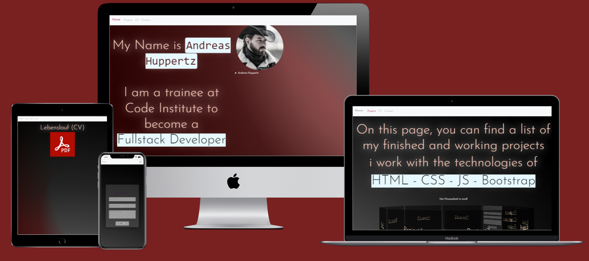

# Code Institute Projekt 1 HTML and CSS - TESTING
 
 ## My Portfolio Website

 
 
 [View MrhaJu on Github Pages](https://mrhaju.github.io/Code-Institute-Projekt-1-CSS-HTML/)

## Contents

* [AUTOMATED TESTING](#automated-testing)
    * [W3C Validator](#w3c-validator)
    * [Lighthouse](#lighthouse)
    * [Wave](#wave)
    * [jshint](#javascript-validator)

* [MANUAL TESTING](#manual-testing)
    * [Full Testing](#full-testing)
    * [User Stories](#user-stories)
    * [Browser Testing](#browser-testing)

* [BUGS](#bugs)
    * [Known Bugs](#known-bugs)
    * [Solved Bugs](#solved-bugs)

---

## AUTOMATED TESTING

The Automated Testing includes all the testing that is carried out by a program, like W3C HTML validation.

Testing was ongoing throughout the entire build. I utilised Chrome developer tools while building to pinpoint and troubleshoot any issues as I went along.

### W3C Validator

* [Index Page HTML](assets/images/testing/w3c/w3cindex.png)
* [Projects Page HTML](assets/images/testing/w3c/w3cprojects.png)
* [CV Page HTML](assets/images/testing/w3c/w3c-cv.png)
* [Contact Page HTML](assets/images/testing/w3c/w3ccontact.png)

#### **CSS Validation**

* [style.css CSS](assets/images/testing/w3c/w3ccss.png)

---

### JavaScript Validator

[jshint](https://jshint.com/) was used to validate the JavaScript.

* [contactform.js](documentation/testing/validation/jshint-contact.png)
* [projects2.js](assets/images/testing/jshint/jshint-projects.png)

- - -

### Lighthouse

I used Lighthouse within the Chrome Developer Tools to allow me to test the performance, accessibility, best practices and SEO of the website.

lighthouse testing :
* #### Desktop:

    * [Index Page - Test ](assets/images/testing/lighthouse/lighthouse-index-pc.png)
    * [Projects Page - Test ](assets/images/testing/lighthouse/lighthouse-projects-pc.png)
    * [Cv Page - Test ](assets/images/testing/lighthouse/lighthouse-cv-pc.png)
    * [Contact Page - Test ](assets/images/testing/lighthouse/lighthouse-contact-pc.png)

* #### Mobile:

    * [Index Page - Test ](assets/images/testing/lighthouse/lighthouse-index-mobile.png)
    * [Projects Page - Test ](assets/images/testing/lighthouse/lighthouse-projects-mobile.png)
    * [Cv Page - Test ](assets/images/testing/lighthouse/lighthouse-cv-mobile.png)
    * [Contact Page - Test ](assets/images/testing/lighthouse/lighthouse-contact-mobile.png)

### WAVE

* [Wave Index](assets/images/testing/wave/wave-index.png)
* [Wave projects](assets/images/testing/wave/wave-projects.png)
* [Wave cv](assets/images/testing/wave/wave-cv.png)
* [Wave contact](assets/images/testing/wave/wave-contact.png)

- - -

## MANUAL TESTING

The following issues were raised during my mid project meeting with my mentor:

* There was an issue on smaller devices where . This issue is documented under issue 2 in solved bugs.

### Solved Bugs

| Bug No | Bug Issue | How Resolved |
| :--- | :--- | :--- |
| 1 | On the Index Page, the Image and Figcaption disappeared behind the navbar. | With Bootstrap order-md-1 and 2, this problem was solved |
| 2 | On Cv page, when turning the Card, the CV was off center | fixed with display: flex and margin-left: -100% |

### Known Bugs

| Known Bug No | Bug Issue | Plan to Resolve |
| :--- | :--- | :--- |
| 1 | There seems to be a bug when resizing from desktop to mobile. The text partially disappears behind the navbar | adding Linebreaks |
| 2 | The navbar burger icon pushing over the right screenside on projects page and disappears on smaller screens | :--- |

- - -

### Full Testing

Full testing was performed on the following devices, and additional testing for other devices was carried out using developer tools:

Desktop PC Windows 11, Samsung S20 Ultra, 46 inch monitor, 43 inch Ultra Wide 4k monitor, 27 inch monitor, windows 10 17 inch laptop

Each device tested the site using the following browsers:

Google Chrome and Microsoft edge 

| Feature | Expected Outcome | Testing Performed | Result | Pass/Fail |
| --- | --- | --- | --- | --- |
| `NAVBAR` |  |  |  |  |
|  |  |  |  |  |
| Navbar Home link | When clicked you are redirected to the home page | Clicked link | Redirected to home page | Pass|
| Navbar projects link | When clicked you are redirected to the Projects Page | Clicked link | Redirected to Projects Page | Pass |
| Navbar projects link - hover | When hovered over the link will be italic, bold and colorized | Hovered over link |  link is italic, bold and colorized | Pass |
| Navbar cv link | When clicked you are redirected to the CV page | Clicked link | Redirected to CV page | Pass |
| Navbar cv link - hover | When hovered over the link will be italic, bold and colorized | Hovered over link |  link is italic, bold and colorized | Pass |
| Navbar contact link | When clicked you are redirected to the Contact  page | Clicked link | Redirected to contact page | Pass |
| Navbar contact link - hover | When hovered over the link will be italic, bold and colorized | Hovered over link |  link is italic, bold and colorized | Pass |
|  |  |  |  |  |
| `Index Page` |  |  |  |  |
| Text Hover  | When hover over Text it will change colour | Hovered over Text | colour changed | Pass |
| Image Text | When click on Text below the Image, Details will be shown | clicked Text | Details showed up | Pass |
|  |  |  |  |  |
| `projects Page` |  |  |  |  |
| Text Hover  | When hover over Text it will change colour | Hovered over Text | colour changed | Pass |
| Carousel stop | When hover over Carousel, it stops turning.  | Hovered over carousel | turning stopped | Pass |
| Carousel scroll | When hover over Carousel, scrolling with Mousewheel scrolls through carousel | Hovered over Carousel, scrolled Mousewheel | Carousel scrolls | Pass |
| Carousel click | When click on a Projekt, shown in the Caousel it opens a new Page with the Project | clicked on Projekt in Carousel | New Page opens, shows project | Pass |
|  |  |  |  |  |
| `CV Page` |  |  |  |  |
| Hover Image | When hovering over the Image on Desktop Screen, it turns 180° and shows the CV | Hovered over Image | Image turns around and showed CV  | Pass |
|  |  |  |  |  |
| `CONTACT Page` |  |  |  |  |
|  |  |  |  |  |
| Submit Form Button - No information entered by user | The form will direct the user to fill in the name field | Clicked submit button with no information filled in | Asked to fill in name field | Pass |
| Submit Form Button - Some information entered | User will be directed to fill in the fields they have left blank | Filled in only part of the form | Asked to fill in the missing fields | Pass |
| Submit form button - all fields filled out | Modal pop up with message confirming message successfully sent | Filled in all forms and pressed submit | Modal popped up with success message | Pass |
| Submit button - hover | when hovered over the button changes colour | Hovered over button | Button changed colour | Pass |
| Name input - focus | When input field is clicked on the border of the input field will change colour | Clicked on input field | Border changed colour | Pass |
| Email input - focus | When input field is clicked on the border of the input field will change colour | Clicked on input field | Border changed colour | Pass |
| Text Area - focus |When text area is clicked on the border of the text area will change colour | Clicked on text area | Border changed colour | Pass |
|  |  |  |  |  |
| `FOOTER` |  |  |  |  |
|  |  |  |  |  |
| Youtube Icon Hover | When hover over icon, Icon colour changes | Hovered over Icon | colour changed | Pass |
| Youtube  Icon | When clicked you will be redirected to MrHaJu's Youtube page in a new tab | Clicked icon | Profile opened in a new tab | Pass |
| Instagram Icon Hover | When hover over icon, Icon colour changes | Hovered over Icon | colour changed | Pass |
| Instagram Icon | When clicked you will be redirected to MrHaJu's Instagram page in a new tab | Clicked icon | Profile opened in a new tab | Pass |
| TikTok Icon Hover | When hover over icon, Icon colour changes | Hovered over Icon | colour changed | Pass |
| TikTok Icon | When clicked you will be redirected to MrHaJu's Tiktok page in a new tab | Clicked icon | Profile opened in a new tab | Pass |

---

### User Stories
| Goals | How are they achieved? | Image |
|---|---|---|
| `First Time Visitors` |  |  |
|  |  |  |
| Understand what the site is for and how to navigate the site. | A description of what the site is is included on the home page. | :--- |
| Navigate to the projects page and view projects that have already been published | a carousel is integrated on the projects page in which the finished projects are available for selection | :--- |
| Navigate to the CV page and view the CV | On the CV page is a PDF image that if you hover over it on a desktop pc or laptop it will open the CV as a PDF for viewing. on mobile devices you can click on the PDF image and the CV will be downloaded | :--- |
| navigate to the Contact page to send a message to the site owner | On the contact page there is a contact form in which you can send your name, email address and a message to my Googlemail address. | :--- |
|  |  |  |
|`Returning Visitors`|  |  |
|  |  |  |
| Navigate to the projects page and view new projects that have been published | a carousel is integrated on the projects page in which the finished projects are available for selection | :--- |
| Navigate to the CV page and view the CV | On the CV page is a PDF image that if you hover over it on a desktop pc or laptop it will open the CV as a PDF for viewing. on mobile devices you can click on the PDF image and the CV will be downloaded | :--- |
| Navigate to the Contact page to send a message to the site owner | On the contact page there is a contact form in which you can send your name, email address and a message to my Googlemail address. | :--- |
|  |  |  |

---

### Browser Testing
| Browser | Layout | Functionality |
| :--- | :--- | :--- |
| Chrome | Desktop | Works |
| Chrome | Mobile | Works |
| Edge | Desktop | Works |
| Edge | Mobile | Works |
| Firefox | Desktop | Works |
| Firefox | Mobile | Works |

---

Back to [README.md](readme.md)